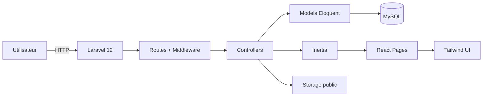

# Komita

<p align="center">
  <a href="#fr">🇫🇷 Français</a>
</p>

<a id="fr"></a>

Plateforme web de suivi de **challenges étudiants** et de gestion d'**événements pédagogiques** (bootcamps, ateliers, sessions) avec validation des candidatures, publication de contenus, interactions sociales et administration complète.

## Sommaire

- [Aperçu](#aperçu)
- [Fonctionnalités principales](#fonctionnalités-principales)
- [Stack technique](#stack-technique)
- [Architecture](#architecture)
- [Captures d'écran](#captures-décran)
- [Installation locale](#installation-locale)
- [Configuration](#configuration)
- [Lancement en développement](#lancement-en-développement)
- [Base de données](#base-de-données)
- [Comptes et rôles](#comptes-et-rôles)
- [Routes principales](#routes-principales)
- [Sécurité et permissions](#sécurité-et-permissions)
- [Structure du projet](#structure-du-projet)
- [Qualité et tests](#qualité-et-tests)
- [Roadmap](#roadmap)
- [Licence](#licence)

---

## Aperçu

**Komita** est une application full-stack Laravel + React (Inertia) conçue pour:

- permettre aux étudiants de créer et documenter leurs challenges quotidiens,
- permettre aux professeurs de créer des événements, filtrer les candidatures et publier des éléments de programme,
- offrir une dimension communautaire (commentaires, suivi d'étudiants, notifications),
- donner à l'administration une vision globale et des actions de modération.

Le projet est orienté usage réel: workflow par rôle, restrictions d'accès fines, historique d'activité, et expérience UI moderne.

---

## Fonctionnalités principales

### 1) Authentification et profils

- Authentification Laravel Breeze (register/login/logout).
- Rôles applicatifs:
  - `student`
  - `professor`
  - `admin`
- Profil utilisateur enrichi:
  - nom/prénom,
  - spécialité,
  - contact,
  - réseaux sociaux (LinkedIn/GitHub/Instagram).
- Page profil publique utilisateur (`/users/{user}`), consultable depuis les feeds et pages détaillées.

### 2) Dashboard intelligent par rôle

- **Admin**: redirection automatique vers `/admin`.
- **Professeur**:
  - vue de ses événements,
  - stats de soumissions,
  - pilotage des candidatures.
- **Étudiant**:
  - vue de ses challenges,
  - progression,
  - section événements déjà démarrés auxquels il a été accepté.

### 3) Challenges

- Création de challenge par étudiant.
- Date de début prise en compte avant toute activité.
- Rapports journaliers avec logique de progression.
- Commentaires communautaires.
- Corrections par professeur/admin.
- Réponses du propriétaire du challenge sur les corrections.
- Follow/unfollow d'étudiants avec notifications associées.

### 4) Événements

- Création d'événements (professeur/admin).
- Planning:
  - jour unique,
  - ou période multi-jours (bootcamp).
- Date limite de candidature avec précision temporelle.
- Candidature unique par utilisateur à un événement.
- Workflow de review côté prof/admin:
  - accepter,
  - décliner,
  - retirer.
- Démarrage de l'événement après fermeture des candidatures.
- Accès au contenu réservé aux participants acceptés (et gestionnaires).
- Publication d'éléments de programme.
- Pièces jointes de contenu:
  - jusqu'à **10 fichiers par élément de programme**,
  - téléchargement sécurisé.

### 5) Home communautaire

- Feed global challenges + événements.
- Recherche par mot-clé.
- Liens directs vers détails (challenge, événement, profils).

### 6) Notifications

- Centre de notifications avec marquage lu.
- Notifications sur les actions importantes:
  - création challenge,
  - rapport challenge,
  - correction/commentaire,
  - candidatures événements,
  - review de soumission,
  - démarrage événement,
  - activités suivies.

### 7) Administration

- Panel administrateur complet.
- Gestion utilisateurs:
  - mise à jour infos,
  - changement de rôle,
  - blocage/déblocage,
  - suppression.
- Gestion contenus:
  - suppression challenge,
  - suppression événement.
- Vue détaillée d'un utilisateur avec historique consolidé.

---

## Stack technique

### Backend

- PHP `^8.2`
- Laravel `^12`
- Inertia Laravel `^2`
- Sanctum
- Ziggy

### Frontend

- React `^18`
- Inertia React `^2`
- Vite `^6`
- Tailwind CSS
- Framer Motion
- Heroicons
- i18next + react-i18next
- react-hot-toast

### Base de données

- Migrations Laravel (MySQL recommandé en local dans ce projet).

---

## Architecture



### Middleware clés

- `auth`
- `verified`
- `not_blocked`
- `admin`

---

## Captures d'écran

Voici un petit aperçu :


---

## Installation locale

### Prérequis

- PHP 8.2+
- Composer
- Node.js 18+ et npm
- MySQL (ou autre SGBD compatible Laravel)

### Étapes

```bash
# 1) Cloner
git clone https://github.com/FulbertDev-AI/komita.git
cd komita

# 2) Dépendances PHP/JS
composer install
npm install

# 3) Variables d'environnement
cp .env.example .env
php artisan key:generate

# 4) Configurer la DB dans .env puis migrer
php artisan migrate

# 5) Lancer les assets
npm run dev

# 6) Lancer le serveur Laravel (autre terminal)
php artisan serve
```

Application disponible par défaut sur:

- Backend: `http://127.0.0.1:8000`
- Frontend Vite: `http://127.0.0.1:5173`

---


---

## Lancement en développement

### Option A (simple, 2 terminaux)

```bash
php artisan serve
npm run dev
```

### Option B (orchestration Composer)

```bash
composer run dev
```

Cette commande lance serveur, queue listener, logs et Vite en parallèle.

---

## Base de données

Migrations déjà prévues pour:

- utilisateurs et rôles,
- challenges, rapports, commentaires, corrections,
- événements, soumissions, éléments de programme,
- fichiers attachés aux éléments d'événement,
- notifications applicatives,
- système de follow,
- blocage utilisateur.

Commandes utiles:

```bash
php artisan migrate
php artisan migrate:status
php artisan migrate:fresh --seed
```

---

## Comptes et rôles

Rôles fonctionnels:

- `student`: crée des challenges, soumet des rapports, postule aux événements.
- `professor`: crée/pilote des événements, valide les soumissions, publie du contenu.
- `admin`: supervision globale, modération, gestion utilisateurs et contenus.

Pour promouvoir un utilisateur admin (exemple):

```bash
php artisan tinker
```

```php
$user = App\Models\User::where('email', 'admin@example.com')->first();
$user->role = 'admin';
$user->save();
```

---

## Routes principales

### Public

- `GET /`
- `GET /events/{code}`

### Authentifié

- Dashboard: `GET /dashboard`
- Home: `GET /home`
- Profil: `/profile`
- Notifications: `/notifications`

### Challenges

- `GET /challenges/create`
- `POST /challenges`
- `GET /challenges/{id}`
- `GET|POST /challenges/{id}/report`
- `POST /challenges/{id}/comments`
- `POST /challenges/{id}/corrections`
- `POST /challenges/{id}/corrections/{correction}/reply`

### Événements

- `GET /events/create`
- `POST /events`
- `POST /events/{code}/submit`
- `DELETE /events/{code}/submission`
- `PATCH /events/{code}/submissions/{submission}`
- `PATCH /events/{code}/start`
- `POST /events/{code}/elements`
- `GET /events/{code}/elements/{element}/files/{file}`

### Admin

- `GET /admin`
- `PATCH /admin/users/{user}`
- `PATCH /admin/users/{user}/role`
- `PATCH /admin/users/{user}/block`
- `DELETE /admin/users/{user}`
- `DELETE /admin/events/{event}`
- `DELETE /admin/challenges/{challenge}`

---

## Sécurité et permissions

- Contrôle d'accès basé rôle + ownership.
- Blocage utilisateur centralisé via middleware.
- Téléchargement de fichiers sous contrôle serveur (pas d'accès public direct non autorisé).
- Validation stricte des payloads (`FormRequest`/`validate`).

---

## Structure du projet

```text
app/
  Http/
    Controllers/
    Middleware/
    Requests/
  Models/
resources/
  js/
    Components/
    Pages/
routes/
  web.php

database/
  migrations/

docs/
  images/
```

---

## Qualité et tests

### Lint PHP

```bash
./vendor/bin/pint
```

### Tests

```bash
php artisan test
```

### Build front

```bash
npm run build
```

---

## Roadmap

- Export PDF des bilans challenge/événement.
- Dashboard analytics avancé (charts + cohortes).
- Notifications temps réel (WebSockets).
- Pagination/virtualisation pour gros volumes admin.
- Suite de tests E2E (Cypress/Playwright).

---

## Licence

Projet basé sur Laravel (MIT). 
